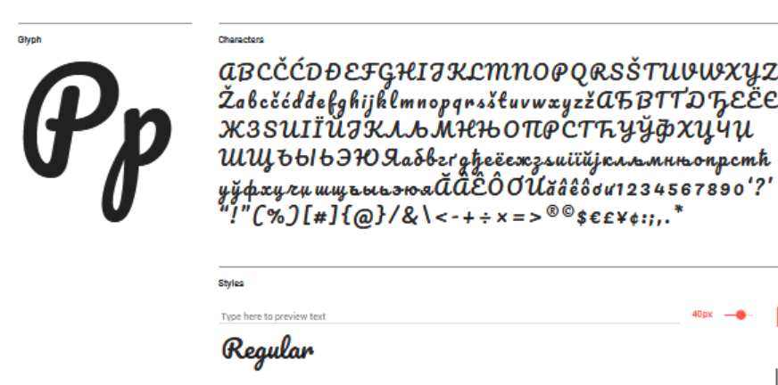
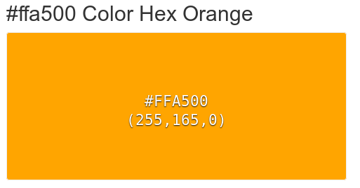
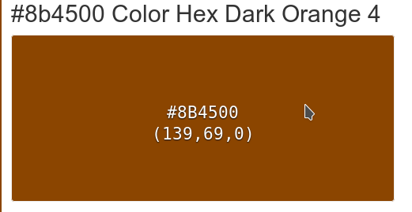
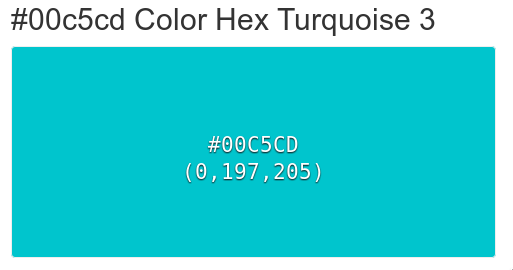

**Thème 3**

**TYPO**

<<<<<<< HEAD
**PACIFICO**
=======
**TITRE**
**1er** **proposition** **(Police Pacifico)** 

>>>>>>> dc0afeda285091af6822e1deca81993876fd9173

**HELLO TROPICAL**

**TROPICAL FOREST**

**Couleurs**

<<<<<<< HEAD

=======
Déclinaison couleur:

   ****Palette Sunset Tropique****

  
>>>>>>> dc0afeda285091af6822e1deca81993876fd9173

  

<<<<<<< HEAD
=======
    
-   En quête de sensations fortes
    
-   Lâcher prise
    
-   Appel à l’aventure
    

 ****Palette Tropique****

Palette classique représentant les couleurs de la forêt tropicale

Cette couleur est associée a :
>>>>>>> dc0afeda285091af6822e1deca81993876fd9173

    

 

