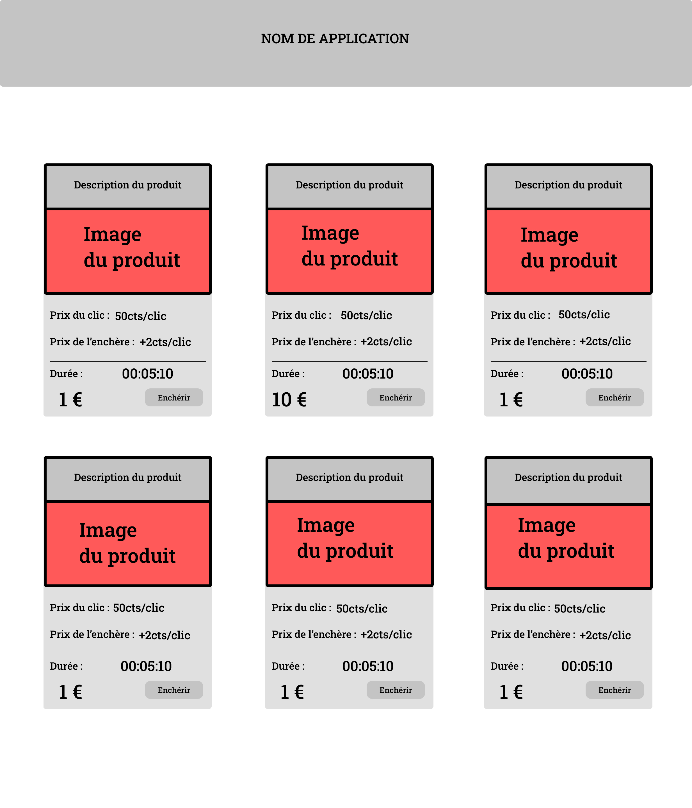
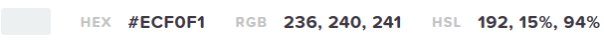
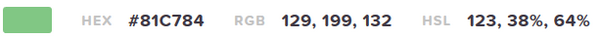

# ****Création d’un proof of concept d’une plateforme d'enchères au centime****

## Concept de l'application web :
En tant que client, je souhaite pouvoir enchérir sur un produit proposé afin de pouvoir remporter l'enchère jusqu'à la fin du temps imparti.

## client :
ToTo Corp.

## User Stories 
| Role                      | Quoi?                                                     | Pourquoi?                                         |
| :------------------------ | :-------------------------------------------------------- | :------------------------------------------------ |
| En tant qu’utilisateur    | Consulter le produit dont enchère est en cours            | Savoir si le produit est toujours disponible      |
| En tant qu’utilisateur    | Connaître le temps restant de l’enchère                   | Savoir le temps restant pour enchérir             |
| En tant qu’utilisateur    | Pouvoir naviguer de façon simple sur le site              | Comprendre rapidement le fonctionnement           |
| En tant qu’utilisateur    | Que l'application soit responsive                                 | Pouvoir encherir sur tous les support écrans      |
| En tant qu’utilisateur    | Voir le titre du site sur homepage                        | Reconnaitre apply du premier regard               |

## Wireframe

## Palettes de couleurs retenu par le client :

* Orange : #FF9800
  * Plus agressif, l’orange est parfait pour les « call to action » et provoque l’envie d’acheter ou de s’abonner. 
  * Fanta, qui vise un public jeune dans son marketing, propose un orange vif qui capte l’attention d’un public très demandé et provoque un sentiment de confiance lors de l’achat.

* Blanc : #ecf0f1
  * Assimilé à la pureté, à la paix et qu'il est le symbole de la sagesse, l'innocence, la pureté et le Divin.

* Vert :  #81c784
  * Tres utilisée pour promouvoir des produits
  * Stimulant de concentration
  * Attire l'attention (exemple le feu vert d'un feu de circulation et donne le GO)
  * Couleur de l'espoir, méditation, inspiration

